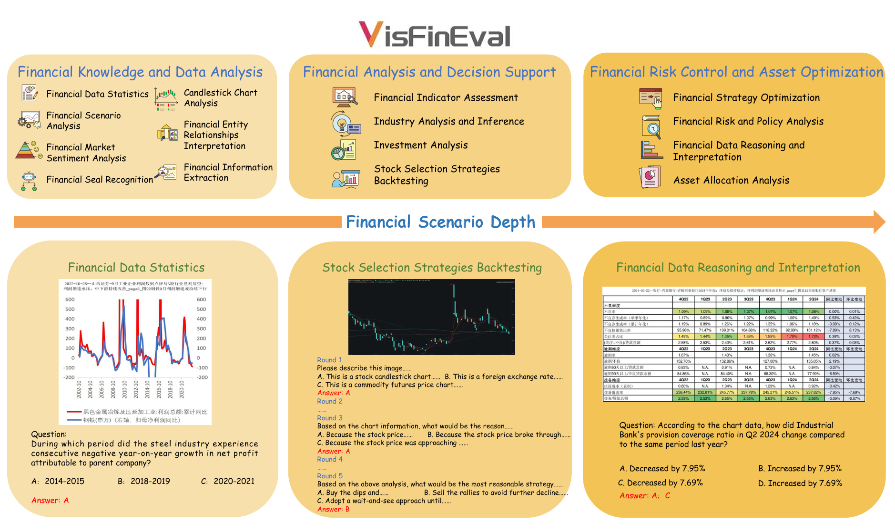

<div align="center">
# VisFinEval: 一个用于评估视觉语言模型的中文金融知识基准
<!-- 语言切换链接 -->

   [简体中文](./README_zh_CN.md) | [English](./README.md) 
</div>

## 📌 目录 <a name="toc"></a>

1. [介绍](#intro)
2. [数据集](#comparison)
3. [结果](#results)
4. [使用说明](#usage)
5. [未来展望](#future)
6. [联系我们](#connection)
5. [引用](#cite)
---

## 💡 介绍 <a name="intro"></a>

VisFinEval 是一个大规模的中文金融领域多模态测试基准，旨在系统评估多模态大语言模型（MLLMs）在真实金融业务场景中的能力表现。该数据集包含15,848组标注的问答对，覆盖8种典型金融图像模态（如K线图、财务报表等），并划分为三个递进式难度层级：金融知识与数据分析、金融分析与决策支持、金融风控与资产优化。我们对21个前沿MLLMs进行零样本测试，结果显示，尽管最佳模型Qwen-VL-max以76.3%准确率超越非专业人类表现，但在多步数值推理、业务流程理解等高级领域特定任务上仍显著落后金融专家超过14个百分点。

  
[返回顶部](#toc)

---

##  📖 数据集 <a name="comparison"></a>

### 数据集对比

下表对比了多个问答数据集在不同维度上的表现，包括问题类型、金融能力评估和规模。

|**基准名称**|**问题类型**|**多层次难度**|**场景深度**|**真实环境模拟**|**公章识别**|**财务关系图**|**金融人物类型数量**|**融资场景数量**|**总问题数**|**评估模型数量**|
| ------------------------- | ----------------------------------------- | -------------------------- | ------------------ | ------------------------------------ | ----------------------------- | -------------------------------- | ------------------------------------ | --------------------------------- | ------------------- | ------------------------------ |
| **Text-based Benchmarks** |                                           |                            |                    |                                      |                               |                                  |                                      |                                   |                     |                                |
| FinDABench                | Open-ended                                | ✓                          | -                  | -                                    | -                             | -                                | -                                    | 5                                 | 2400                | 40                             |
| SuperCLUE-Fin             | Open-ended                                | ✗                          | -                  | -                                    | -                             | -                                | -                                    | 6                                 | 1000                | 11                             |
| CFBenchmark               | Open-ended                                | ✗                          | -                  | -                                    | -                             | -                                | -                                    | 8                                 | 3917                | 22                             |
| FinEval                   | Multiple-choice + Open-ended              | ✗                          | -                  | -                                    | -                             | -                                | -                                    | 9                                 | 8351                | 19                             |
| **Multimodal Benchmarks** |                                           |                            |                    |                                      |                               |                                  |                                      |                                   |                     |                                |
| SEEDBENCH                 | Multiple-choice                           | ✗                          | ✗                  | ✗                                    | ✗                             | -                                | -                                    | -                                 | 19000               | 18                             |
| MMMU                      | Multiple-choice                           | ✓                          | ✗                  | ✗                                    | ✗                             | ✗                                | -                                    | -                                 | 11500               | 30                             |
| FinVQA                    | Open-ended                                | ✗                          | ✗                  | ✗                                    | ✗                             | ✗                                | 2                                    | 2                                 | 1025                | 9                              |
| FIN-FACT                  | True/False                                | ✗                          | ✗                  | ✗                                    | ✗                             | ✗                                | 2                                    | 5                                 | 3369                | 4                              |
| FAMMA                     | Multiple-choice + Open-ended              | ✓                          | ✗                  | ✗                                    | ✗                             | ✗                                | 3                                    | 8                                 | 1758                | 4                              |
| MME-Finance               | Open-ended                                | ✓                          | ✗                  | ✗                                    | ✗                             | ✗                                | 6                                    | 11                                | 2274                | 19                             |
| **VisFinEval (Ours)**     | Multiple-choice + True/False + Open-ended | ✓                          | ✓                  | ✓                                    | ✓                             | ✓                                | 8                                    | 15                                | 15848               | 21                             |

---

### 任务设置

VisFinEval 包含三类问题场景，共有 15 种业务场景类型：

#### **场景类型**:

-**金融知识数据分析** : FDS，CCA，FIA，FERI，SSSB，FIE，FSR

-**金融分析与业务决策**  : FSA，IAI，IA，FMSA

-**金融风险控制与资产优化** : FSO，FRPA，FDRI，AAA 全用中文不加缩写

### **问题类型分布**：

| 场景维度                                      | 金融场景                                  | 问题数量  |
| -------------------------------------------- | --------------------------------------- | --------- |
| **金融知识与数据分析**                          | 金融数据统计 (FDS)                        | 3,655     |
|                                              | K线图解析 (CCA)                          | 1,124     |
|                                              | 金融指标评估 (FIA)                       | 1,160     |
|                                              | 金融实体关系解读 (FERI)                   | 919       |
|                                              | 选股策略回测 (SSB)                       | 719       |
|                                              | 金融信息抽取 (FIE)                       | 924       |
|                                              | 金融印章识别 (FSR)                       | 199       |
|                                              | **合计**                               | **8,700** |
| **金融分析与决策支持**                          | 金融情景分析 (FSA)                       | 2,040     |
|                                              | 行业分析与推断 (IAI)                     | 1,361     |
|                                              | 投资分析 (IA)                           | 933       |
|                                              | 金融市场情绪分析 (FMSA)                  | 316       |
|                                              | **合计**                               | **4,650** |
| **金融风控与资产优化**                          | 金融策略优化 (FSO)                      | 111       |
|                                              | 金融风险与政策分析 (FRPA)                | 181       |
|                                              | 金融数据推理与解读 (FDRI)                | 1,839     |
|                                              | 资产配置分析 (AAA)                      | 367       |
|                                              | **合计**                               | **2,498** |
| **视觉金融评估体系**                           | **总计**                               | **15,848** |

---

## 🏆 结果 <a name="results"></a>

### 模型评估结果

| Model                          | Size    | Limit                | FDS  | CCA  | FIA  | FERI | SSSB | FIE  | FSR  | FSA  | FMSA | FSO  | FRPA | FDRI | AAA  | WA   |
| ------------------------------ | ------- | -------------------- | ---- | ---- | ---- | ---- | ---- | ---- | ---- | ---- | ---- | ---- | ---- | ---- | ---- | ---- |
| Qwen-VL-max                    | Unknown | /                    | 78.8 | 90.5 | 87.4 | 89.2 | 86.2 | 90.6 | 77.9 | 65.3 | 83.1 | 82.3 | 76.8 | 49.1 | 58.2 | 76.3 |
| Qwen-VL-max-latest             | Unknown | /                    | 76.0 | 84.5 | 86.1 | 87.1 | 79.3 | 88.6 | 84.4 | 59.6 | 82.6 | 82.8 | 79.3 | 44.0 | 52.2 | 73.8 |
| InternVL3-78B                  | 78B     | /                    | 71.2 | 83.5 | 71.4 | 86.7 | 79.5 | 87.8 | 87.4 | 64.3 | 82.1 | 80.4 | 78.7 | 49.1 | 52.8 | 72.5 |
| Doubao-1.5-vision-pro-32k      | Unknown | /                    | 75.6 | 79.0 | 84.2 | 85.5 | 76.8 | 91.7 | 74.4 | 56.7 | 80.2 | 79.8 | 77.3 | 30.0 | 54.5 | 71.7 |
| InternVL2.5-78B                | 78B     | /                    | 73.3 | 77.9 | 72.3 | 84.2 | 84.0 | 88.4 | 82.9 | 63.3 | 81.5 | 80.1 | 75.2 | 41.0 | 53.1 | 71.5 |
| Qwen2.5-VL-72B                 | 72B     | /                    | 75.9 | 77.0 | 72.8 | 85.4 | 81.5 | 88.3 | 80.4 | 57.4 | 82.4 | 80.3 | 74.5 | 41.4 | 53.4 | 71.0 |
| GPT-4o-2024-11-20              | Unknown | /                    | 72.0 | 76.8 | 74.9 | 81.7 | 71.8 | 83.8 | 83.9 | 61.9 | 77.9 | 78.5 | 73.2 | 41.0 | 40.5 | 68.5 |
| Step-1o-vision-32k             | Unknown | /                    | 48.9 | 78.4 | 80.2 | 84.1 | 75.3 | 88.2 | 98.0 | 40.3 | 78.8 | 78.6 | 76.1 | 39.2 | 45.2 | 68.4 |
| Moonshot-V1-32k-vision-preview | Unknown | /                    | 56.2 | 82.8 | 73.4 | 80.5 | 73.9 | 87.6 | 68.3 | 61.9 | 77.7 | 77.0 | 72.3 | 39.2 | 55.8 | 68.3 |
| Qwen2.5-VL-7B                  | 7B      | /                    | 71.4 | 75.9 | 69.2 | 80.9 | 74.0 | 85.5 | 69.9 | 53.4 | 79.7 | 76.5 | 70.7 | 37.2 | 37.6 | 65.4 |
| InternVL3-8B                   | 8B      | /                    | 68.2 | 78.0 | 62.8 | 87.0 | 74.1 | 84.0 | 77.4 | 56.5 | 76.1 | 76.8 | 71.7 | 29.7 | 46.2 | 65.4 |
| Gemini-2.5-pro-exp-03-25       | Unknown | /                    | 73.6 | 76.7 | 72.6 | 81.0 | 73.0 | 89.4 | 87.4 | 53.2 | 72.4 | 70.8 | 75.5 | 28.4 | 38.0 | 64.7 |
| Claude-3-7-Sonnet-20250219     | Unknown | /                    | 70.5 | 73.4 | 80.3 | 71.1 | 77.5 | 83.2 | 34.7 | 48.0 | 76.1 | 75.5 | 64.0 | 26.8 | 50.3 | 62.9 |
| Qwen2.5-VL-3B                  | 3B      | /                    | 69.5 | 81.1 | 65.9 | 76.6 | 73.6 | 83.4 | 72.4 | 50.0 | 75.4 | 74.7 | 66.6 | 22.9 | 34.8 | 62.4 |
| MiniCPM-V-2.6                  | 8B      | /                    | 61.3 | 83.5 | 56.9 | 76.7 | 75.2 | 73.4 | 80.9 | 48.3 | 69.7 | 70.7 | 69.1 | 20.6 | 35.5 | 60.1 |
| Llama-3.2-11B-Vision-Instruct  | 11B     | /                    | 56.9 | 40.8 | 59.3 | 63.9 | 62.9 | 73.1 | 70.4 | 45.3 | 69.7 | 67.1 | 63.4 | 18.0 | 22.1 | 50.9 |
| Molmo-7B-D-0924                | 7B      | /                    | 60.1 | 74.8 | 54.5 | 62.2 | 59.1 | 60.5 | 42.2 | 39.7 | 64.4 | 62.8 | 63.4 | 23.4 | 31.7 | 49.8 |
| GLM-4v-Plus-20250111           | Unknown | Multi-image Limit    | 73.8 | 86.6 | 87.9 | 87.5 | 81.2 | 89.3 | 72.7 | 56.5 | 78.1 | 74.9 | 74.6 | 45.1 | 54.1 | 72.0 |
| LLaVA-NEXT-34B                 | 34B     | Context Window Limit | 55.3 | 79.8 | 92.3 | 63.2 | 87.8 | 55.0 | 58.8 | 54.3 | 88.2 | 88.1 | 66.9 | 13.1 | 17.5 | 56.0 |
| LLaVA-v1.6-Mistral-7B          | 7B      | Context Window Limit | 54.6 | 73.4 | 65.9 | 62.1 | 47.4 | 47.0 | 62.3 | 42.3 | 58.3 | 56.4 | 63.7 | 10.2 | 16.3 | 47.8 |
| LLaVA-NEXT-13B                 | 13B     | Context Window Limit | 50.2 | 64.8 | 43.9 | 57.2 | 62.5 | 50.2 | 38.7 | 34.7 | 59.2 | 59.0 | 52.9 | 14.7 | 10.8 | 43.0 |

[返回顶部](#toc)

---

## 🔧  使用说明 <a name="usage"></a>

---

### 1.项目结构 

```
VisFinEval/
├── data/                                              # Raw datasets
│   ├── figure/                                        # Image assets
│   ├── markdown/                                      # Markdown-formatted data
│   ├── Financial Knowledge and Data Analysis          # Front Office Scenario Type data
│   ├── Financial Analysis and Business Decision       # Middle Office Scenario Type data
│   └── Financial Risk Control and Asset Optimization  # Back Office Scenario Type data
├── logs/                  						       # Runtime logs
├── output/                	              		       # Model outputs
├── scripts/             						       # Execution scripts
│   ├── visfineval.py    						       # test scripts
│   └── run_model.sh      						       # Unified evaluation scripts
├── README.md          						           # Project documentation
└── requirements.txt    					           # Dependency specifications
```

### 2.安装指南

- **克隆仓库**:

  ​        下载 `VisFinEval` 仓库。

- **下载数据集**:

  从以下 Google Drive 链接下载数据集：
  [https://drive.google.com/file/d/15DdloCn2GWRvyO-kieTJMiE2sMIfW4vF/view?usp=drive_link](https://drive.google.com/file/d/1NIIZE5O6HFAS12rw160No9SUZVTpLgZK/view?usp=sharing)

  解压下载的文件，并将其放置在 `VisFinEval/data` 目录下。

- **安装依赖**:

```bash
 pip install -r requirements.txt
```

### 3. **运行所有评估问题类型**

- **使用 `run__model.sh` 脚本运行所有评估问题类型:**

  ```bash
  bash run_model.sh
  ```

- **模型配置用于评估:**

  - **API 模型配置:**

    根据注释修改模型设置:

    ```bash
    # API Model Configuration (Format: API_KEY, API_BASE_URL, Model Name)
    USE_API=true 
    API_MODEL_NAME="your_model_name"
    API_KEY="your_model_key"
    API_BASE_URL="your_url"
    ```

  - **本地模型配置:**

    根据注释修改模型设置:

    ```bash
    # Local Model Configuration (Format: Model Name, Model Path, Model Type, Additional Parameters)
    USE_API=false
    API_MODEL_NAME="your_model_name"
    MODEL_PATH="your_model_address"
    ```

---

### 4. **输出结果**

- 评估结果输出在 `VisFinEval/output` 和 `VisFinEval/logs` 文件夹中。
- 输出结果按问题类型组织，每个文件夹进一步按模型分类。

## 🚀 未来展望 <a name="future"></a> 

FinGAIA的测试结果传递出一个清晰的信号：对于金融行业而言，单纯提升大语言模型的知识储备已不足够。**如何让模型学会像人一样熟练、协同地使用各种分析工具，才是决定其能否成为可靠生产力的关键**。
我们计划：
* **开放数据集**：发布 **150道带注释的开发者问题集**。
* **维护排行榜**：以排行榜的形式，持续追踪并展示全球顶尖AI智能体在金融领域的表现。

榜单会定期进行更新，纳入更多可用智能体。欢迎对智能体评测感兴趣的个人和机构联系与交流。

## 📫 联系我们 <a name="connection"></a>
诚邀业界同仁共同探索 AI 与金融深度融合的创新范式，共建智慧金融新生态，并通过邮件与zhang.liwen@shufe.edu.cn联系

## 📚 引用 <a name="cite"></a> 

如果您在研究中使用了VisFinEval，请引用我们的论文。

```bibtex
@article{liu2025visfineval,
  title={VisFinEval: A Scenario-Driven Chinese Multimodal Benchmark for Holistic Financial Understanding},
  author={Liu, Zhaowei and Guo, Xin and Xia, Haotian and Zeng, Lingfeng and Lou, Fangqi and Niu, Jinyi and Li, Mengping and Qi, Qi and Li, Jiahuan and Zhang, Wei and others},
  journal={arXiv preprint arXiv:2508.09641},
  year={2025}
}
```

[返回顶部](#toc)
