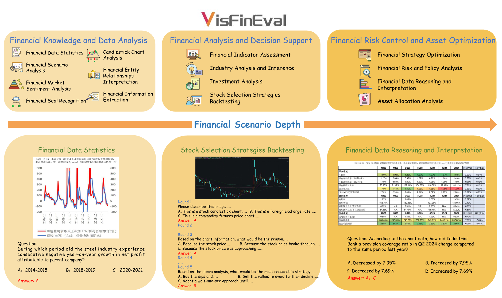

# VisFinEval: 一个用于评估视觉语言模型的中文金融知识基准

## Table of Contents <a name="toc"></a>

1. [介绍](#intro)
2. [数据集](#comparison)
3. [结果](#results)
7. [使用说明](#usage)

---

## 介绍 <a name="intro"></a>

VisFinEval 是一个大规模的中文基准，旨在评估多模态大语言模型（MLLMs）在真实金融场景中的表现。该数据集包含 15494 对问答，涵盖 8 种金融图像类型，分为 3 个难度级别。我们对 22 个 MLLMs 进行了零样本评估，结果表明，尽管一些模型在基础任务上表现良好，但在多步数值推理和高级领域特定任务方面仍落后于人类表现。


[返回顶部](#toc)

---

##  数据集 <a name="comparison"></a>

#### 1.数据集对比

下表对比了多个问答数据集在不同维度上的表现，包括问题类型、金融能力评估和规模。

| Benchmarks  | Question Type | Number of QA Type | Hallucination Assessment | Financial Professional Competence | Official Seal | Financial Relationship Graph | NoP   | NoM  |
| ----------- | ------------- | ----------------- | ------------------------ | --------------------------------- | ------------- | ---------------------------- | ----- | ---- |
| SEEDBENCH   | MC            | 12                | ✓                        | ✗                                 | ✗             | ✗                            | 19000 | 18   |
| MMMU        | MC+ SA+ FB    | 11                | ✓                        | ✓                                 | ✗             | ✗                            | 11500 | 28   |
| FIN-FACT    | T/F           | 2                 | ✗                        | ✓                                 | ✗             | ✗                            | 3562  | 4    |
| FinVQA      | SA            | 9                 | ✗                        | ✓                                 | ✗             | ✗                            | 1025  | 9    |
| FAMMA       | MC+ OE        | 8                 | ✗                        | ✓                                 | ✗             | ✗                            | 1758  | 4    |
| MME-FINANCE | OE            | 11                | ✓                        | ✓                                 | ✗             | ✗                            | 2274  | 19   |
| VisFinEvaL  | MC+ T/F+ CQ   | 13                | ✓                        | ✓                                 | ✓             | ✓                            | 15494 | 22   |

---

#### 2.任务设置

VisFinEval 包含三个难度级别，共有 13 种问题类型：

**难度级别**:

1. **基础金融场景（L1）** : MCQ-3, MCQ-4, MAQ, T/F, CI, TA
2. **复杂金融场景（L2）**  : MTD, MIQ, SPQ
3. **金融极限挑战（L3）** : MCE, CPQ, MLE, CCQ

**问题类型分布**

| Image Type                   | MCQ-3 | MCQ-4 | MAQ  | T/F  | CI   | TA   | MTD  | MIQ  | SPQ  | MCE  | CPQ  | MLE  | CCQ  | Total |
| ---------------------------- | ----- | ----- | ---- | ---- | ---- | ---- | ---- | ---- | ---- | ---- | ---- | ---- | ---- | ----- |
| Financial Relationship Graph | 176   | 393   | 345  | 357  | 144  | /    | 68   | 353  | 310  | /    | 55   | /    | /    | 2201  |
| Line Chart                   | 192   | 189   | 109  | 275  | 110  | 168  | 200  | 195  | 137  | /    | 49   | /    | /    | 1624  |
| Histogram                    | 336   | 290   | 235  | 381  | 409  | /    | 200  | 158  | 205  | /    | 46   | /    | /    | 2260  |
| Candlestick Chart            | 249   | 170   | 51   | 424  | 232  | 232  | 199  | 160  | 128  | /    | /    | /    | /    | 1845  |
| Pie Chart                    | 355   | 329   | 315  | 456  | 479  | /    | 192  | 79   | 204  | /    | 50   | /    | /    | 2459  |
| Official Seal                | 98    | 101   | /    | /    | /    | /    | /    | /    | /    | /    | /    | /    | /    | 199   |
| Financial Statement          | 180   | 287   | 434  | 451  | 378  | /    | 113  | 28   | 251  | 55   | /    | 60   | /    | 2237  |
| Supporting Data Table        | 424   | 324   | 316  | 460  | 478  | /    | 108  | 33   | 281  | 145  | /    | 50   | 50   | 2669  |
| **Total**                    | 2010  | 2083  | 1805 | 2804 | 2230 | 400  | 1080 | 1006 | 1516 | 200  | 200  | 110  | 50   | 15494 |

---

## 结果 <a name="results"></a>

#### 模型评估结果

| Model                          | Size    | Limit                | MCQ-3    | MCQ-4    | MAQ      | T/F      | TA       | CI       | MTD      | MIQ      | SPQ      | MCE      | CPQ      | MLE      | CCQ      | WA       |
| ------------------------------ | ------- | -------------------- | -------- | -------- | -------- | -------- | -------- | -------- | -------- | -------- | -------- | -------- | -------- | -------- | -------- | -------- |
| Qwen-VL-max-latest             | Unknown | /                    | **85.2** | **85.3** | 50.6     | **83.6** | 65.9     | **89.2** | 84.3     | 76.6     | **79.5** | 50.0     | 76.5     | **60.9** | 33.9     | **70.9** |
| Qwen-VL-max                    | Unknown | /                    | 83.6     | 83.3     | **51.4** | 81.9     | **67.3** | 87.5     | **90.6** | **82.3** | 74.9     | **52.5** | 74.0     | 52.7     | 30.5     | 70.2     |
| Doubao-1.5-vision-pro-32k      | Unknown | /                    | **85.2** | 80.4     | 46.4     | 77.3     | 51.4     | 76.7     | 85.7     | 73.7     | 75.8     | 51.5     | **77.5** | 48.2     | **68.5** | 69.1     |
| Gemini-2.0-Flash               | Unknown | /                    | 80.9     | 77.4     | 49.6     | 76.2     | 62.7     | 80.0     | 84.9     | 70.4     | 75.6     | 45.5     | 71.5     | 50.9     | 43.3     | 66.8     |
| Qwen2.5-VL-72B                 | 72B     | /                    | 79.5     | 77.9     | 39.4     | 75.6     | 79.1     | 71.9     | 83.9     | 70.4     | 75.8     | 54.4     | **77.5** | 50.9     | 43.3     | 66.8     |
| InternVL2.5-78B                | 78B     | /                    | 81.8     | 78.7     | 49.7     | 71.9     | 64.4     | 81.7     | 85.7     | 65.1     | 78.2     | 46.0     | 64.5     | 50.5     | 22.8     | 64.7     |
| Moonshot-V1-32k-vision-preview | Unknown | /                    | 82.8     | 78.4     | 45.5     | 73.6     | 65.6     | 77.5     | 82.3     | 71.3     | **79.5** | 44.0     | 60.0     | 49.4     | 19.7     | 63.8     |
| InternVL2.5-78B-MPO            | 78B     | /                    | 81.9     | 78.5     | 49.0     | 72.5     | 61.3     | 69.2     | 88.3     | 63.5     | 76.9     | 45.2     | 69.0     | 39.4     | 31.6     | 63.6     |
| GPT-4o-2024-11-20              | Unknown | /                    | 73.4     | 71.3     | 42.3     | 74.1     | 79.2     | 75.9     | 71.3     | 67.8     | 66.7     | 42.0     | 58.8     | 57.3     | 34.9     | 62.4     |
| Claude-3.5-Sonnet              | Unknown | /                    | 79.2     | 75.5     | 39.2     | 69.6     | 57.5     | 68.3     | 86.2     | 67.8     | 76.2     | 38.0     | 61.0     | 52.7     | 38.5     | 62.3     |
| Step-1o-vision-32k             | Unknown | /                    | 76.9     | 75.6     | 44.2     | 71.8     | 54.4     | 75.0     | 81.7     | 68.0     | 74.2     | 36.5     | 54.5     | 45.5     | 23.5     | 62.1     |
| InternVL2.5-26B                | 26B     | /                    | 81.9     | 76.6     | 43.6     | 55.4     | 56.5     | 80.8     | 83.8     | 69.8     | 76.7     | 39.0     | 37.5     | 44.0     | 13.2     | 58.4     |
| Qwen2.5-VL-7B                  | 7B      | /                    | 78.1     | 74.4     | 37.9     | 64.6     | 64.4     | 73.5     | 85.0     | 63.9     | 69.6     | 38.5     | 51.5     | 50.8     | 10.5     | 55.9     |
| Qwen2.5-VL-3B                  | 3B      | /                    | 75.6     | 68.8     | 35.5     | 73.2     | 54.3     | 65.0     | 79.9     | 62.5     | 69.6     | 33.5     | 51.5     | 42.7     | 8.5      | 55.9     |
| InternVL2.5-8B                 | 8B      | /                    | 74.3     | 70.1     | 41.0     | 72.2     | 61.3     | 69.2     | 88.3     | 63.5     | 76.9     | 45.5     | 69.0     | 39.4     | 31.6     | 63.6     |
| MiniCPM-V-2.6                  | 8B      | /                    | 64.8     | 57.5     | 27.2     | 69.7     | 48.9     | 63.3     | 75.7     | 61.9     | 62.8     | 24.5     | 31.5     | 30.9     | 5.2      | 48.0     |
| Llama-3.2-11B-Vision-Instruct  | 11B     | /                    | 56.5     | 55.8     | 15.7     | 49.5     | 40.2     | 54.2     | 73.1     | 42.6     | 62.3     | 17.0     | 31.5     | 30.9     | 2.5      | 40.9     |
| Molmo-7B-D-0924                | 7B      | /                    | 46.3     | 43.1     | 17.4     | 68.6     | 40.7     | 46.7     | 68.6     | 51.2     | 57.3     | 16.0     | 25.0     | 37.3     | 5.5      | 40.3     |
| GLM-4v-Plus-20250111           | Unknown | Multi-image Limit    | **71.4** | **62.3** | **41.4** | 71.0     | 45.4     | 60.0     | **85.7** | /        | **75.6** | **45.5** | **50.0** | /        | /        | 60.8     |
| LLaVA-NeXT-34B                 | 34B     | Context Window Limit | 58.9     | 44.4     | 6.1      | 62.4     | **59.2** | **60.8** | 72.0     | /        | 67.0     | 30.0     | 28.5     | /        | /        | 48.9     |
| LLaVA-v1.6-Mistral-7B          | 7B      | Context Window Limit | 47.9     | 42.3     | 11.5     | **71.2** | 37.2     | 52.5     | 65.7     | /        | 54.2     | 13.5     | 33.5     | /        | /        | 43.0     |
| LLaVA-NeXT-13B                 | 13B     | Context Window Limit | 42.5     | 32.1     | 14.2     | 57.4     | 20.8     | 44.2     | 66.4     | /        | 54.3     | 21.0     | 20.5     | /        | /        | 37.3     |
| **Human**                      | /       | /                    | 90.8     | 88.9     | 83.8     | 94.0     | 75.2     | 92.4     | 82.6     | 79.3     | 80.7     | 71.5     | 85.8     | 63.6     | 68.2     | 81.1     |

[返回顶部](#toc)

---

## 使用说明 <a name="usage"></a>

---

#### 1.项目结构 

```
VisFinEval/
├── data/                    # Raw datasets
│   ├── figure/              # Image assets
│   ├── markdown/            # Markdown-formatted data
│   ├── L1_Q1.tsv            # L1_Q1 task data
│   ├── ...
│   └── L3_Q4.tsv            # L3_Q4 task data
├── logs/                    # Runtime logs
├── output/                  # Model outputs
├── scripts/                 # Execution scripts
│   ├── L1/                 # L1 task scripts
│   ├── L2/                 # L2 task scripts 
│   ├── L3/                 # L3 task scripts
│   └── run_api_model.sh     # Unified evaluation scripts
├── src/                     # Core source code
│   ├── L1/                 # L1 evaluation source code
│   ├── L2/                 # L2 evaluation source code
│   └── L3/                 # L3 evaluation source code
├── README.md                # Project documentation
└── requirements.txt         # Dependency specifications
```

#### 2.安装指南

- **克隆仓库**:

  ​        下载 `VisFinEval` 仓库。

- **下载数据集**:

  从以下 Google Drive 链接下载数据集：
  https://drive.google.com/file/d/15DdloCn2GWRvyO-kieTJMiE2sMIfW4vF/view?usp=drive_link

  解压下载的文件，并将其放置在 `VisFinEval/data` 目录下。

- **安装依赖**:

```bash
     pip install -r requirements.txt
```

#### 3. **运行所有评估问题类型**

- **使用 `run_api_model.sh` 脚本运行所有评估问题类型:**

  ```bash
  bash run_api_model.sh
  ```

- **模型配置用于评估:**

  - **API 模型配置:**

    根据注释修改模型设置:

    ```bash
    # API Model Configuration (Format: API_KEY, API_BASE_URL, Model Name)
    API_CONFIGS=(
        "your_api_key_1;https://api.provider1.com/v1;model_name_1"
        "your_api_key_2;https://api.provider2.com/v1;model_name_2"
    )
    ```

  - **本地模型配置:**

    根据注释修改模型设置:

    ```bash
    # Local Model Configuration (Format: Model Name, Model Path, Model Type, Additional Parameters)
    LOCAL_MODEL_CONFIGS=(
    "model1, /path/to/model1, type1, --tp 2 --gpu_ids 0,1"
    "model2, /path/to/model2, type2, --tp 2 --gpu_ids 2,3"
    )
    ```

---

#### 4. **运行特定问题类型**

- 在 `scripts/L1`, `L2`, `L3` 文件夹中，每个问题类型的评估脚本需要配置模型路径和 API 设置:

- 取消注释以评估相应的模型

  ```bash
  # Set model paths
  MODEL_PATH_1="Path to Local Model 1"
  MODEL_PATH_2="Path to Local Model 2"
  
  # Set API configuration
  API_KEY="your_key"
  API_BASE_URL="API base URL"
  API_MODEL_NAME="API model name"
  
  ...
  
  ...
  
  # Main function
  main() {
      check_prerequisites
      # Uncomment the following line to run the API model
      run_api_model
      # Uncomment the following lines to run local models
      # run_model "Model 1 Name" "$MODEL_PATH_1" "model_type" "--tp" "2" "--gpu_ids" "4,5"
      # run_model "Model 2 Name" "$MODEL_PATH_2" "model_type" "--tp" "2" "--gpu_ids" "4,5"
      echo "All model evaluations are completed!"
  }
  ```

---

#### 5. **输出结果**

- 评估结果输出在 `VisFinEval/output` 和 `VisFinEval/logs` 文件夹中。
- 输出结果按问题类型组织，每个文件夹进一步按模型分类。

[返回顶部](#toc)